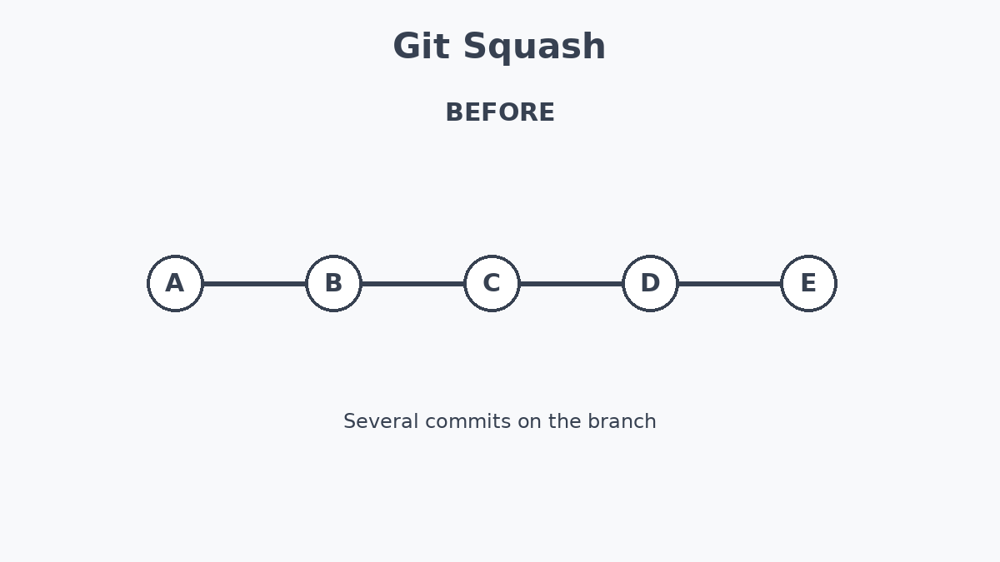

# LinkedIn Posts Submission

## Post 1: Git Squash

- **Post Link:** [https://www.linkedin.com/feed/update/urn:li:activity:7502660717532258305/]
- **Date Published:** 2026-09-07

### Post Content:

كنت فاكر ان كل ما اعمل commit اكتر يعني كدا بعمل progress اكبر
بس الحقيقه لا
وفهمت ان كثرة ال commits ممكن تخلي Git History غير منظم وصعب لو حد شغال ورايا انه يراجعه

ممكن نفهم مع بعض commend "git squash"

بكل بساطه squash بيسمحلك تدمج اكتر من commits في commit واحده

بمعني لو انا شغال علي feature بدل ما اعمل commits

fix bug
fix bug again
fix typo
final fix

اقدر ادمج ده كله في commit واحده
الجزء اللي عجبني في موضوع ال Git مش مجرد اجاة بنستخدمها عشان نحفظ الكود
لكن هي حاجه بتساعدنا نحافظ علي تاريخ منظم وواضح للتغييرات وده مهم جدا خصوصا لما تشتغل مع team
كل Concept بنتعلمه في Git بيخليني افهم بشكل افضل ال Workflow لمشاريع SWD الحقيقة

#Git #GitHub #SoftwareDevelopment #Programming #LearningInPublic #SimulationAcademy

